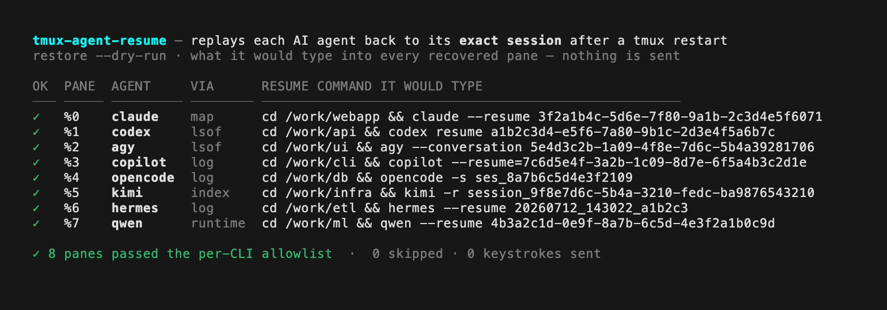
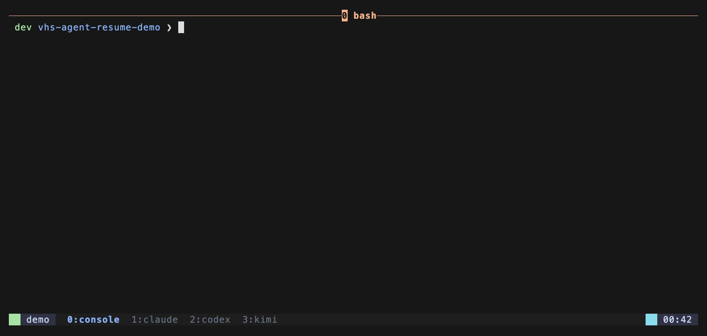

# tmux-agent-resume（中文說明）

> English: [README.md](../README.md)


**v1 僅支援 macOS。** 反查會用到 BSD 工具的輸出格式（`stat -f`、`date -j`、BSD
`ps`、`lsof`），因此這一版只鎖定 macOS。Linux 尚未支援：CI 在 Linux 上只跑
shellcheck，實際行為只在 macOS 驗證。開發與測試環境為 **tmux next-3.8**
（HEAD-9180356），2026-07。



*還原（dry-run）：對每個復原的 pane，插件把「將會」打入、用來把該 AI CLI 接回自己 session 的確切指令記進 log —— 每一條都先過各 CLI 白名單 —— 全程不送任何按鍵。*

---

## 1. 這是什麼？

你在某個 tmux pane 裡跑著 AI 編碼助手——Claude Code、Codex、Copilot 等等——對話
正進行到一半。這時 tmux 崩潰、你重開機、或看門狗重啟了 server。一般情況下這段
對話就沒了：pane 回來是空的，或 CLI 以全新 session 重啟，先前記得的一切都消失。

**tmux-agent-resume 把對話接回來。** 它與
[tmux-resurrect](https://github.com/tmux-plugins/tmux-resurrect)（負責還原視窗與
pane）協同運作。在 resurrect 存檔前，本插件記下每個 pane 裡是哪個 AI CLI、以及
如何接回它「當下那個」session；在 resurrect 還原後，把正確的續傳指令打進每個
pane——讓 agent 從斷點接續，而不是從零開始。

支援 **8 個 CLI**：Claude Code、Codex、Antigravity（`agy`）、Copilot、OpenCode、
Kimi、Hermes、Qwen。每個 CLI 把 session id 藏在不同地方，插件知道各自要去哪裡找
（見 [per-cli-matrix.md](per-cli-matrix.md)）。

---

## 2. 快速開始

**前置需求**：macOS、**tmux 1.9 以上**（用 `tmux -V` 查）、且**已安裝
tmux-resurrect**（這是 peer dependency——本插件是它的延伸）。

以下所有地方，**`prefix`** 指你的 tmux 前綴鍵——除非你改過，否則就是
**`Ctrl-b`**。所以「按 `prefix` 再按 `r`」是：按住 Ctrl、點一下 `b`、放開、再點
一下 `r`。

### 路徑 A — 沒有用外掛管理器（現在就能用）

複製貼上這三步：

```sh
# 1. 把插件下載到固定位置
git clone https://github.com/operonlab/tmux-agent-resume ~/.tmux/plugins/tmux-agent-resume

# 2. 叫 tmux 載入它——在設定檔尾端加一行
echo "run-shell ~/.tmux/plugins/tmux-agent-resume/agent-resume.tmux" >> ~/.tmux.conf

# 3. 重新載入 tmux 設定（在 tmux 裡：按 prefix 再按 r，或執行這行）
tmux source-file ~/.tmux.conf
```

除了 Claude Code 需要多一小步（見 §3），其他 CLI 到這裡就設定完成了。

### 路徑 B — 使用 TPM（tmux 外掛管理器）

**還沒裝 TPM** 的話先裝：

```sh
git clone https://github.com/tmux-plugins/tpm ~/.tmux/plugins/tpm
```

並確認 `~/.tmux.conf` 的最後一行是：

```tmux
run '~/.tmux/plugins/tpm/tpm'
```

**接著加入兩個插件**，放在 `run` 那行**上面**（resurrect 在前，我們接在它後面）：

```tmux
set -g @plugin 'tmux-plugins/tmux-resurrect'
set -g @plugin 'operonlab/tmux-agent-resume'
```

重新載入設定（`prefix` `r`），再按 `prefix` `I`（大寫 i）讓 TPM 下載。完成。

---

## 3. Claude Code 的額外一步（選用，但建議）

Claude Code 是唯一無法從外部讀回「當下」session id 的 CLI——它得靠 SessionStart
hook 即時擷取。插件內附這個 hook 與它的安裝器：

```sh
bash ~/.tmux/plugins/tmux-agent-resume/hooks/install-claude-hook.sh
```

這會冪等地在 `~/.claude/settings.json` 加入一筆設定（會保留你既有的 hook）。要指
向別的設定目錄，設 `CLAUDE_CONFIG_DIR`。要移除：

```sh
bash ~/.tmux/plugins/tmux-agent-resume/hooks/install-claude-hook.sh uninstall
```

**誠實降級**：不裝這個 hook，Claude Code 仍會續傳——只是走 *argv 模式*：重跑
pane 原本的指令。全新啟動（argv 裡沒有 id）的會回到一個新 session；hook 才是讓
Claude 接回同一段對話的關鍵。其他每個 CLI 不需要任何 hook 就能完整運作。

---

## 4. Demo



一次 dry run（`@agent-resume-dry-run 1`）：restore 讀取儲存時記錄的快照，把每個 pane
*將會*輸入的 resume 指令印進 log —— 每一筆都先通過各 CLI 的白名單 —— 全程不送任何按鍵、
不啟動任何 CLI。

---

## 5. 選項

在 `~/.tmux.conf` 於插件載入**之前**設定（即 `run '.../tpm'` 或 `run-shell` 那行
上面）：

| 選項 | 預設 | 作用 |
|------|------|------|
| `@agent-resume-tools` | `claude codex agy copilot opencode kimi hermes qwen` | 以空白分隔的 CLI 白名單，決定要快照/續傳哪些。不想動的移掉即可。 |
| `@agent-resume-dry-run` | `0` | `1` = 只記錄「將會打什麼」，不真的送出。第一次試很適合。 |
| `@agent-resume-log` | `$TMUX_TMPDIR/tmux-agent-resume-<uid>/agent-resume.log` | 插件寫活動日誌的位置。 |
| `@agent-resume-snapshot-file` | `~/.tmux/resurrect/agents.tsv` | pane → 續傳指令的旁車 TSV，存在 resurrect 檔案旁邊。 |
| `@agent-resume-map-dir` | `$TMUX_TMPDIR/tmux-agent-resume-<uid>/claude-map` | Claude SessionStart hook 寫 pane → session-id 對照的位置。你覆寫它時，hook 在 tmux 內會自動跟上。 |

範例：

```tmux
set -g @agent-resume-dry-run 1
set -g @agent-resume-tools 'claude codex qwen'
```

> **安全提醒。** 依設計，還原時會**把續傳指令打進你的 pane 並按 Enter**——這正是
> 它的用途。送出前，每一條指令都會先過一道嚴格的 per-CLI 白名單
> （`scripts/validate.sh`）：必須恰好是 `[cd <安全路徑> &&] <tool> <安全旗標>`、
> 不含任何 shell 特殊字元，否則直接丟棄並記錄。想先觀察，就從
> `@agent-resume-dry-run 1` 開始。

---

## 6. 移除

```sh
bash ~/.tmux/plugins/tmux-agent-resume/scripts/teardown.sh   # 解開我們的 resurrect hook（保留你的）
bash ~/.tmux/plugins/tmux-agent-resume/hooks/install-claude-hook.sh uninstall   # 移除 Claude hook
```

再從 `~/.tmux.conf` 刪掉 `@plugin`/`run-shell` 那幾行、移除 clone。你原有的
resurrect hook 值會被保留。

---

## 7. 疑難排解 / FAQ

**重啟後什麼都沒續傳——先看哪裡？**
看日誌：`cat "$(tmux show-option -gqv @agent-resume-log)"`（或 Options 表的預設
路徑）。每筆略過都會寫原因——pane 忙碌、cwd 被拒、白名單未過、沒有快照。設
`@agent-resume-dry-run 1` 再觸發一次 resurrect 存檔+還原，就能看到它「會做什麼」。

**它略過了一個「忙碌」的 pane。** 這是刻意的。若還原後某個 pane 已有進程在跑
（resurrect 重啟了東西，或你自己接手了），插件不會覆蓋打字。它只續傳停在裸 shell
提示字元的 pane。

**我的 Claude session 變成全新對話了。** 你多半跳過了 §3 的 SessionStart hook——
沒有它，Claude 只能以 argv 模式重播。裝上 hook，*下一次*崩潰就會接回同一 session。

**同一資料夾的兩個 Kimi session 混在一起了。** 已知限制：Kimi 會改自己的進程名，
同目錄的多個實例從外部無法分辨。插件會挑最近活躍的那個。見
[per-cli-matrix.md](per-cli-matrix.md#known-limitations)。

**出現「tmux-resurrect not found」。** 本插件單獨無作用——它接在 resurrect 的
存檔/還原 hook 上。裝好
[tmux-resurrect](https://github.com/tmux-plugins/tmux-resurrect) 再重載。

**能在 Linux 跑嗎？** v1 不行。session 反查依賴 BSD/macOS 工具輸出。它不會大聲
報錯，但在 Linux 上不受支援、也未經驗證。

---

## 8. 運作原理（一段話）

`agent-resume.tmux` 把兩段續傳邏輯附加到 tmux-resurrect 的
`@resurrect-hook-post-save-all` 與 `@resurrect-hook-post-restore-all`（鏈接，
絕不覆蓋）。存檔時，`scripts/snapshot.sh` 走過每個 pane、辨識 AI CLI、解析其當下
session id，寫出 `coord ⇥ tool ⇥ mode ⇥ cwd ⇥ resume_cmd` 的 TSV。還原時，
`scripts/restore.sh` 讀該 TSV，對仍停在 shell 提示字元的 pane、經白名單驗證後，
打入續傳指令。各 CLI 細節見 [per-cli-matrix.md](per-cli-matrix.md)。

## 9. 需求與版本說明

- **tmux ≥ 1.9。** 那是 tmux-resurrect 自己的下限；本插件用到的 tmux 功能更早就
  有——`send-keys -l`（tmux 1.7）、自由格式 `@` 使用者選項（tmux 1.8）、
  `pane_current_command` / `pane_current_path`（tmux ≤1.9 / 1.9）。已對照官方
  tmux `CHANGES` 查證。開發與測試於 **tmux next-3.8**。
- **tmux-resurrect**——peer dependency，必須安裝。
- **jq**——只有選用的 Claude hook 安裝器需要。
- **macOS**——見頁首橫幅。

<!-- family-section -->
---

## [operonlab](https://github.com/operonlab) tmux 外掛家族

一組小而專注的外掛，能組合成同一個駕駛艙。上面是原生 tmux **之前**，下面是整個家族 **之後**：


想用哪個就裝哪個：

| 外掛 | 加了什麼 |
|------|----------|
| [tmux-workdesk](https://github.com/operonlab/tmux-workdesk) | 一鍵 IDE ＋ tile/main 窗格佈局 |
| [tmux-floatpane](https://github.com/operonlab/tmux-floatpane) | 彈出式浮動暫存終端機 |
| [tmux-context-menu](https://github.com/operonlab/tmux-context-menu) | 右鍵／prefix 窗格動作選單 |
| [tmux-autosize](https://github.com/operonlab/tmux-autosize) | 背景視窗自動貼合用戶端尺寸 |
| [tmux-passthrough](https://github.com/operonlab/tmux-passthrough) | 把按鍵直接穿透給內層程式 |
| [tmux-sysmon](https://github.com/operonlab/tmux-sysmon) | 即時 CPU／MEM／DISK／NET 膠囊 |
| [tmux-llm-usage](https://github.com/operonlab/tmux-llm-usage) | LLM 配額／花費狀態膠囊 |
| [tmux-agent-status](https://github.com/operonlab/tmux-agent-status) | AI 窗格 busy／blocked／idle 膠囊 |
| [tmux-pillbar](https://github.com/operonlab/tmux-pillbar) | 打造第二列自訂 pill 狀態列 |
| **tmux-agent-resume　—— 你在這** | 崩潰後把每個 AI CLI 還原到原 session |

## 授權

8-CLI 反查邏輯於 2026-07 在 macOS 上跨全部八個 CLI 實戰硬化。設計上與
[tmux-resurrect](https://github.com/tmux-plugins/tmux-resurrect)、
[tmux-continuum](https://github.com/tmux-plugins/tmux-continuum) 互補。

MIT——見 [LICENSE](../LICENSE)。